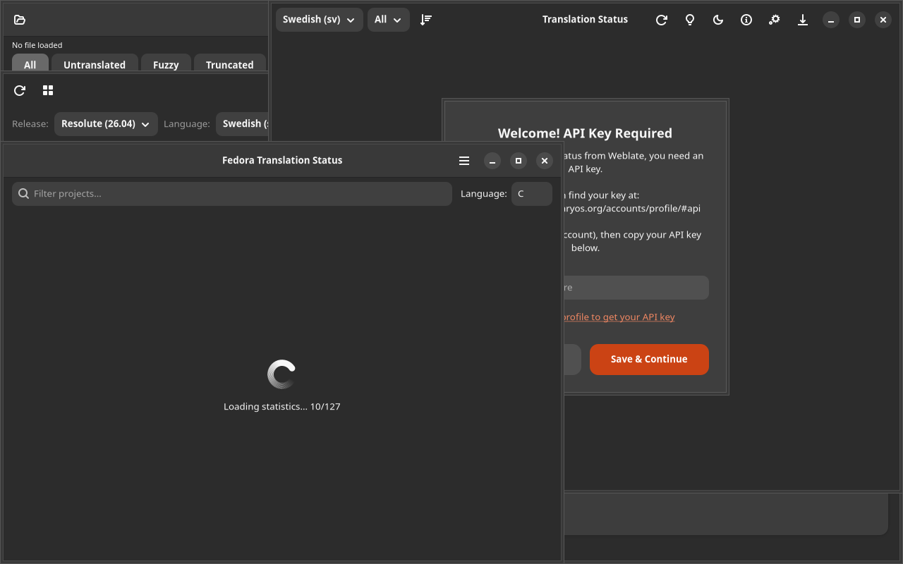

# Glossary Editor

## Screenshot



A GTK4/Adwaita application for creating and managing translation glossaries (TBX/CSV/TSV).

## Features

- Create/open glossary files (TBX, CSV, TSV)
- Add/edit/delete terms (source, target, context, comment)
- Search and filter terms
- Import terms from .po/.ts files (extract frequent terms)
- Export to TBX, CSV, TSV
- Consistency check: scan .po/.ts files against glossary
- Support for multiple languages in the same glossary
- Merge glossaries

## Installation

### Debian/Ubuntu

```bash
# Add repository
curl -fsSL https://yeager.github.io/debian-repo/KEY.gpg | sudo gpg --dearmor -o /usr/share/keyrings/yeager-archive-keyring.gpg
echo "deb [signed-by=/usr/share/keyrings/yeager-archive-keyring.gpg] https://yeager.github.io/debian-repo stable main" | sudo tee /etc/apt/sources.list.d/yeager.list
sudo apt update
sudo apt install l10n-glossary
```

### Fedora/RHEL

```bash
sudo dnf config-manager --add-repo https://yeager.github.io/rpm-repo/yeager.repo
sudo dnf install l10n-glossary
```

### From source

```bash
pip install .
l10n-glossary
```

## 🌍 Contributing Translations

This app is translated via Transifex. Help translate it into your language!

**[→ Translate on Transifex](https://app.transifex.com/danielnylander/l10n-glossary/)**

Currently supported: Swedish (sv). More languages welcome!

### For Translators
1. Create a free account at [Transifex](https://www.transifex.com)
2. Join the [danielnylander](https://app.transifex.com/danielnylander/) organization
3. Start translating!

Translations are automatically synced via GitHub Actions.
## License

GPL-3.0-or-later — Daniel Nylander <daniel@danielnylander.se>
